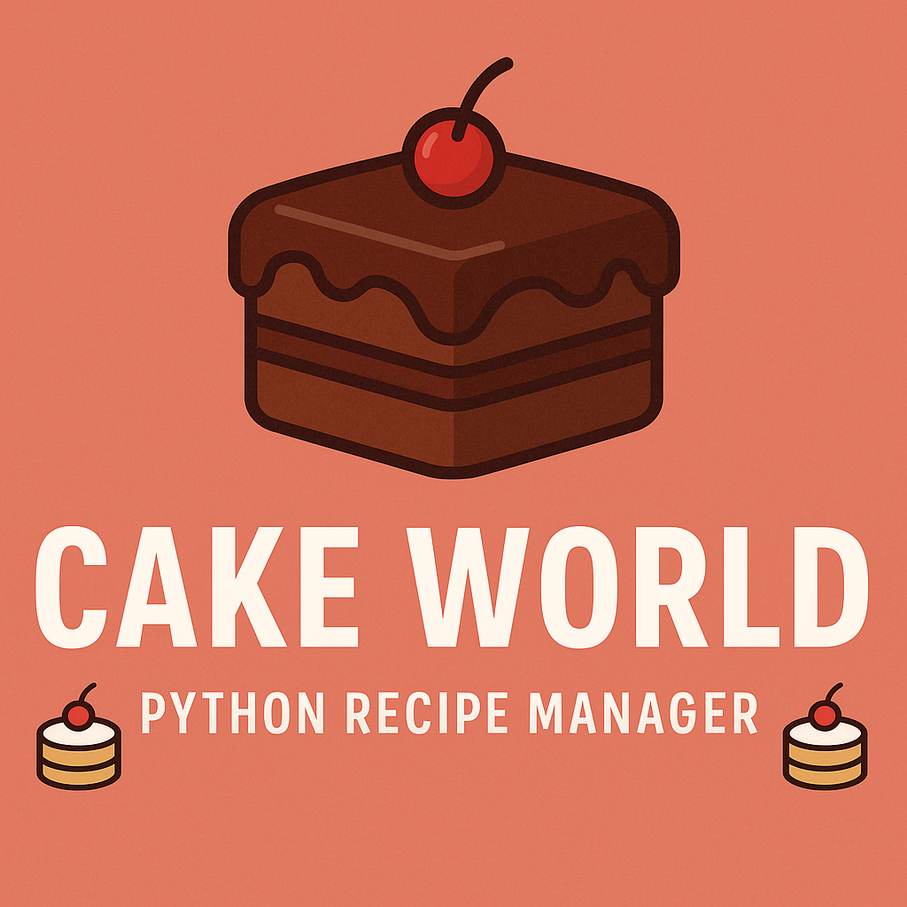

<p align="center">
  
</p>


# 🍰 Cake World - Python Recipe Manager

**Cake World** is a Python console application that allows you to **add**, **view**, **edit**, **delete**, and **list** your favorite cake recipes using simple file handling and regular expressions.

## 📎 Quick Access  
[▶️ Run Script](#-how-to-run) • [📋 Features](#-features) • [📂 File Structure](#-file-structure) • [💡 Future Ideas](#-future-ideas)


---

## 📌 Features

- 📝 Add a new cake recipe  
- 🔍 View a recipe by cake name  
- 🗑️ Delete a recipe by cake name  
- ✏️ Edit a saved recipe  
- 📋 List all saved cake names  
- 📄 Display all saved recipes (formatted)

---

## 🧠 Technologies Used

- Python 3.x  
- File Handling (`open`, `read`, `write`)  
- Regular Expressions (`re` module)  
- Object-Oriented Programming (OOP)

---

## 🚀 How to Run

1. **Clone the repo** or download the code:
   ```bash
   git clone https://github.com/Rumaisas-islam/cake-world.git
   cd cake-world
```

2. **Run the script**:

   ```bash
   python cake_world.py
   ```

3. **Follow the on-screen menu to interact with the app.**

---

## 📂 File Structure

```
cake-world/
│
├── cake_world.py       # Main Python script
├── cake.txt            # File where recipes are saved (auto-created)
└── README.md           # Project description
```

---

## 📌 Sample Menu

```text
______Welcome To The Cake World______

What you want to do
1. Add New Recipe
2. View Recipe by Cake Name
3. Delete Recipe by Cake Name
4. Edit Recipe
5. List All Cake Names
6. Print All Recipes
(1/2/3/4/5/6) or 'q' to quit:
```

---

## 🧁 Example Recipe Format

```text
======================================
Cake_Name:Chocolate Fudge
Cake_Ingredients:Flour, Cocoa, Eggs, Sugar
Cake_Recipe:Mix ingredients and bake at 180°C for 30 mins
======================================
```

---

## 💡 Future Ideas

* 🔍 Search by ingredient
* 🔄 Export/import recipes in JSON
* 🖥 GUI version using Tkinter
* 🌐 Web version using Flask

---

## 🧑‍💻 Author

* [Rumaisa Islam](https://github.com/Rumaisas-islam)

[](https://github.com/Rumaisas-islam/cake-world)


---

## 📝 License

[](https://opensource.org/licenses/MIT)


This project is licensed under the MIT License.
